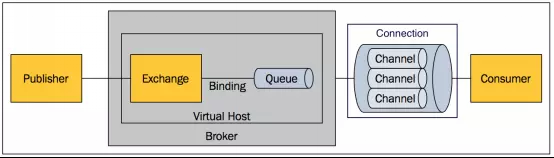

## 起源

AMQP 是实现 Message Queue 消息队列技术的一个重要协议。

MQ 这玩意，早在 80 年代就有了，需求呢来源于当时的金融界。
最早的一款 MQ 软件叫做 the information bus (TIB)。
TIB 之后也被电信和通讯公司采用。

之后是 IBM 开发的 MQSeries，微软开发的 MSMQ。反正这种商业闭源、收费又贵的 MQ 软件越来越多，既然 MQ 变多了，那不如就定个标准协议吧？
摩根大通和 iMatrix 就在 2004 年起草 AMQP。并且在 2006 发布了 AMQP 规范。

那我们接下来就来看看 AMQP 到底定义了写啥么。

<!--more-->

## AMQP

Advance Message Queue Protocol 这是 AMQP 的全称。
看下概念图

Producer -> Broker -> Consumer

- Broker
  接受与分发消息的主体，就是一个应用，比如 rabbitmq server

- Virtual Host
  划分不同的 namespace 个使用同一个 rabbitmq server 的不同用户。

- Connection
  publisher & consumer 与 consumer 之间的 TCP 连接。断开连接的操作只会在 client 端，broker 正常情况下不会主动断开连接。

- Channel
  为了减少每次建立 TCP 连接的开销（TCP协议->TCP 协议源码->字节序->大小端->高低位）。
  其实这也是一种连接资源的复用，一般每个线程会复用同一个 channel。

- Exchange
  message到达broker的第一站，根据分发规则，匹配查询表中的routing key，分发消息到queue中去。所以 Exchange 是一种分发规则。

- Queue
  最终消息都在这里等待被 consumer 领走。一个 message 可以被拷贝到多个 queue 中。

- Binding
  Exchange 和 queue 之间的虚拟连接，binding 中包含routing key。
  Binding 信息会被 Exchange 存储到自己的表中，用来作为分发依据。

### Exchange 的几种类型

#### Direct

最直接的方式，routing key 对上了，咱就往 queue 去呗。

#### Fanout

有点像广播，所有发到 Exchange 上的 message 都会被发到所有的 queue 上去。

#### Topic

Topic 是一个更加细化的 Direct，不光是 routing key，还会有一个通配规则，比如 my.news\ your.news...，如果 topic 规则是 `#.news` 的话，就会都被发送到 news 的 queue 中。

*规则依据是 routing key and routing pattern ，我觉得这样就更容易理解了。比如我指定 routing key = "#.news" Exchange 就会根据其类型投递到对应的 queue。

## RabbitMQ

RabbitMQ 是比较常用的，实现了AMQP协议的消息队列软件。
在说 rabbitmq 之前，我想确保大家都知道，微服务通讯的两种方式。

1. P2P 同步通讯
2. Pub/Sub 异步通讯

[一个好玩的 RabbitMQ 模拟网站](http://tryrabbitmq.com/)

为什么需要 rabbitmq？因为他支持的协议很多呀。

- AMQP
- HTTP
- STOMP
- MQTT

其中 MQTT 更是物联网中最 prefer 的协议。

## 横向比较

在上面四个选项中除去 HTTP，我想将剩余的 3 个做一些和横向比较。

### 与MQTT比较

MQTT: Message Queuing Telemetry Transport，消息队列遥测传输

AMQP: Advanced Message Queuing Protocol，高级消息队列协议

所以一般在工业场景下，如果是作为数据采集端，会使用 MQTT 多一点。有时候保证只传输一次对于工业数据处理是个
十分必要的条件。

## 消息驱动

### 基于消息的分布式架构

由于消息持有双方服务规定的业务数据，在一定程度上违背了封装的要义。换言之，生产与消费消息的双方都紧耦合于消息。消息的变化会直接影响到各个服务接口的实现类。然而，为了尽可能保证接口的抽象性，我们所要处理的消息都不是强类型的，这就使得我们在编译期间很难发现因为消息内容发生变更产生的错误。

## 参考

- <https://www.cnblogs.com/frankyou/p/5283539.html>
- <http://tryrabbitmq.com/>