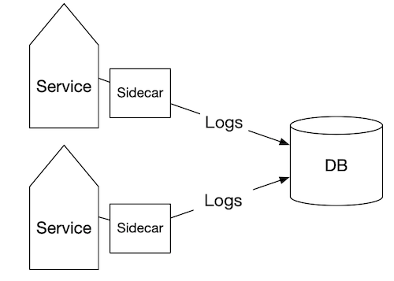
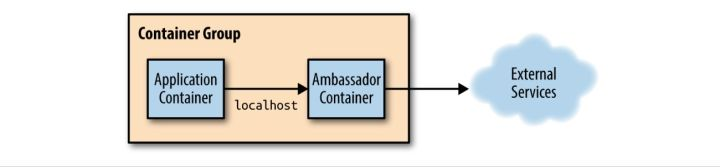
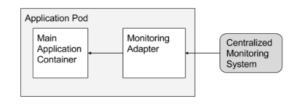
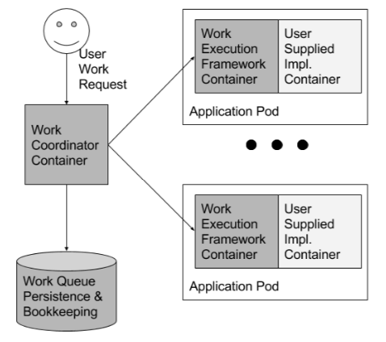

## 概述

这篇文章是对于[【分布式系统设计模式】](https://www.usenix.org/system/files/conference/hotcloud16/hotcloud16_burns.pdf)的个人理解和部分翻译。

文章探讨了关于《基于容器化软件组件的微服务架构》。

其实容器化编程的发展路径和面向对象编程有异曲同工之妙--
都是将复杂的系统进行抽象、解耦，然后通过一定的方式组合起来。

既然我们要组合，肯定会有面对不同情况的不同组合方式。所以，这些不同的组合方式也会有几个常用的固定模式。
而这个正式我们要探讨的--分布式系统设计模式。

说到分布式，第一个联想到的应该就的容器化。
为什么？其实容器化和分布式本没有交集，只是因为我们发现容器化是一个实现分布式的高效的方法。

容器化设置了一个天然的边界，边界之外用接口进行通信。
有了这个边界的好处就是，任何意料之外的情况都可以被限制在最小的影响范围，毕竟我们构建的是一个大型的复杂系统。

我认为，用[FMEA](https://zh.wikipedia.org/wiki/%E5%A4%B1%E6%95%88%E6%A8%A1%E5%BC%8F%E4%B8%8E%E5%BD%B1%E5%93%8D%E5%88%86%E6%9E%90)模型能很好的描述为什么会采用容器化去解构分布式系统。(FMEA，可以理解为：失控的状态一定会发生，我们要做的是控制失控的范围)

所以，我们接下来要说的设计模式基本上都是和容器相关，我们需要把容器作为一等公民去看。
毕竟这是写 Kubernetes 的哥们写的。

## 单容器管理者模式 (Single-container management patterns)

我们为容器增加一些可控接口，比如 run(), stop(), pause()，使得容器对外来说是可控的。

也正是因为广泛的 http 协议支持，你完全可以通过 http 和 JSON这样的序列化方式去构造你应用的对外的 API。

一般来说我们的设计方针都是一个容器提供一种服务。同时容器会为其上下游提供接口。

什么接口？

向上，提供容器本身丰富的信息接口。能够为特定的监控容器运行状态的应用提供信息。

向下，提供了控制容器本身的接口。使得分布式系统能够更有效的管理整个应用的生命周期，以及应用的优先级。

比如，一个集群的管理系统，能够设置集群处理任务的优先级。（比如 K8s 中的抢占式调度）

所以一旦采用这种模式的话，你会需要一个统一的管理平台，通过接口去管理（组管理）单个容器。

## 单节点-多容器应用模式 (Single-node, multi-container application patterns)

这种模式比较好理解，有些容器应用是需要“共生”的，所以我们会将其放在同一个节点上。
一旦这样，分布式系统会对容器组做联合调度。
比如 K8s 里将调度单位描述成了 Pods（一个 Pod 可能包含多个容器），Nomad 则称其为 task groups。
下面几个就是常用的单节点多容器的设计模式：

### 副载模式（Sidecar pattern）

多容器部署最通用的一种模式，就是 sidecar 模式。
其实大家都直接称呼 Sidecar 模式，不会翻译成副载。

那 Sidecar 是个啥样子呢？

举个例子吧：我们有一个主容器是 Web Server，我们需要收集 Web Server 所产生的日志。
所以我们会有一个专门的 sidecar 容器，负责收集日志并把日志存储到集群的存储系统。

另外一个例子，就是主容器的内容呈现，是由一个 sidecar 容器去实时同步的。

还有个例子是为一个 Http Web Server 提供 Https 功能。

你会发现 Sidecar 是主容器的一种扩展和升级，这种模式的好处在于，因为是容器隔离，所以能够保证从属容器不会在主容器需要资源的时候占用过多的资源，因为分配资源的最小单位就是容器。同时，sidecar 一般在功能上比较专职，又是容器化的，所以可以很方便的进行单独的部署、升级。

### 大使模式（Ambassador pattern）

大使模式实现方式是在节点中增加一个通讯代理。他解决的问题是：
为某些年久失修的外部服务，增加一个调用代理，调用者是我们节点上的应用。

大使模式给开发者的好处是：

1. 他们只要考虑应用与本地服务的连接
2. 他们可以在本地进行测试
3. 调用的外部服务语言无关

其实有个很典型但是非容器化的例子，就是 Ribbon 中的客户端负载。
和大使模式很像，所有的请求流量都先经由客户端的负载均衡器决定了流量流向--我们在大使容器中现决定流量流向，然后直接调用真正的服务。

聪明的你会发现，我们似乎可以在大使容器中做很多手脚，比如熔断，路由，流量监控，安全控制等等（有点像服务端的 API 网关）。

没错，所以我们得出了一些使用该模式的场景（来自https://docs.microsoft.com/en-us/azure/architecture/patterns/ambassador）:

- 客户端连接语言无关，框架无关
- 将客户端连接的问题与应用分离，解耦开发
- 为年久失修的应用程序提供云或集群支持

### 适配器模式（Adapter pattern）

和 Ambassador 相比，Adapter 模式向外部呈现了一个统一的接口。（方向反了一下）

最典型的例子应该就是容器管理平台，所有系统中的容器都会有一套统一的监控接口。

现在的容器多种多样，不过只要保证每个容器都有统一的不变的对外监控接口，对于单独的监控工具来说就不难实时收集各个容器的数据了。

单节点多容器的模式主要就是上面三种。

## 多节点应用模式 (Multi-node application patterns)

和单节点多应用模式一样，我们同样要求实现这个模式的系统支持  K8s 中 Pod 这样的概念。

### 领导人选举 (Leader election pattern)

在分布式系统中，老生常谈的问题了，就是领导人选举。

一般领导人选择是怎样一种状态呢？就是在分布式系统中，存在一个或者多个领导人，还有剩下的作为工作节点。
一旦有领导人节点挂了，工作节点按照一定算法升级成为领导人节点。

领导人选举算法是十分复杂的算法（至少对我来说），甚至有些算法库还是语言限定的，所以，更好的方式就是通过容器去使用这个领导人选举功能。

那为什么要分为领导节点和工作节点呢？

当然是为了更好分配任务，分配好了任务，就能保证系统处在一个高效的状态下运行。避免出现有些工作节点空闲，有些工作节点忙的现象。整个模式的思想还是中心化治理最高效的方针。

### 工作队列模式 (Work queue pattern)

我觉得，分布式系统中的工作队列模式，其实表达了一个具有拓扑关系的分布式系统。每个步骤都是单独的，但是他们的输入可能需要依靠上一个输出，亦或者，他们的输出会成为下一个的输入。

这个模式好在他语言无关，我只要知道我的容器的输入输出，然后将它放在合适的位置就可以了。

同时还需要一个专门进行作业管理的容器进行任务的分发。

我在网上并没有找到过多的关于描述 Work queue pattern 的资料。
似乎这种设计模式的叫法不太一样。

### 向量化模式 (Scatter/gather pattern)

这是一种有点广播竞争的模式。

一个外部请求会先被发送到一个“根”或“父”节点。
然后根节点扩散请求并让服务端同时进行竞争，然后每个竞争者都会返回一部分请求的结果，根节点再把碎片结果揉成一个完整的返回。

这样的模式其实对于开发者的要求还是比较高的，因为要对分布式任务处理中产生的异常有很好的把控，同时涉及到了分布式任务一致性。

一般实现这种模式需要至少 2 个容器，一个是用来进行任务分发的，还有一个是进行结果归总的。

## 总结

面向对象编程需要面向对象的设计模式作为支撑。
容器化的分布式系统也一样，需要容器的设计模式作为支撑。

上面我们分析了三种容器架构下的设计模式，一共 7 种。
上面这 7 中模式会以组合的形式出现在分布式系统之中，毕竟分布式系统是一个复杂系统。

这篇文章所依据的论文，虽说是分布式系统的设计模式，但是其实会涉及到很多经典的企业集成模式。所以我在这里向大家推荐一本书[《企业集成模式》](https://book.douban.com/subject/1766652/)。
可别以为是讲企业管理的，这是给开发者看的。

好吧，暂时先这样吧。

